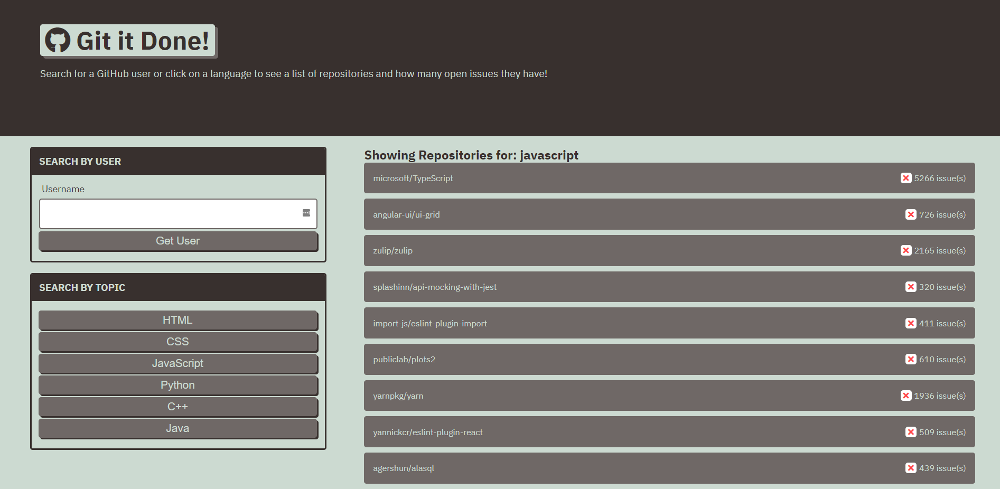

# Git It Done

## Table of Contents
* [Deployed](#deployed)
* [Description](#description)
* [Technologies](#technologies)
* [Usage](#usage)
* [Preview](#preview)
* [Questions](#questions)
* [Credits](#credits)

## Deployed
Access the website at https://sarawrmas.github.io/git-it-done/

## Description
Are you looking to contribute to other developers' projects, but not sure where to start? Git It Done lets you search for GitHub projects by username or topic and view projects with open issues.

## Technologies
* HTML
* CSS
* JavaScript

## Usage
To search for a specific GitHub user, use the "Search By User" textbox to enter their username. Submit your search using the "Get User" button.

To search by language or technology, select your chosen topic from the "Search By Topic" selection in the left pane.

After submitting a search from one of these choices, the results will list in the page body. Projects with open issues will show a box with a red X along with the number of open issues. If a project has no open issues, it will display a blue checkbox.

Click on any project in the result list to view all of its open issues on a separate page. Once on that project's page, click on any issue to view it directly on GitHub.

From the results page, select "Go Back" to return to the search page.

## Preview

## Questions
Have questions about this project?  
GitHub: https://github.com/sarawrmas  
Email: sara.m.adamski@gmail.com

## Credits
Sara Adamski